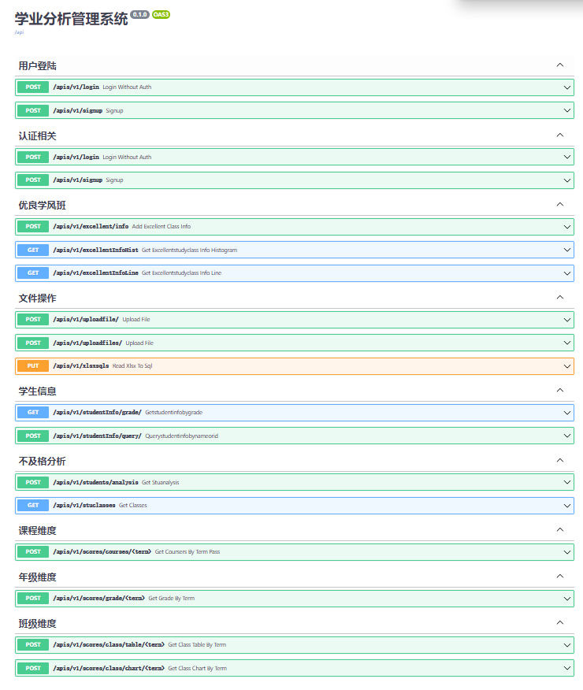

# 后端API接口

包括以下接口(服务启动后，通过 http://127.0.0.1:8888/apis/docs#/  地址在浏览器中查看)



# 启动

```python
# 在根目录下面 /backbone
python main.py
```

数据库更新

[Alembic](https://zhuanlan.zhihu.com/p/90106173#:~:text=FAILED%3A%20Target%20database%20is%20not%20up%20to%20date.,head%20%E5%91%BD%E4%BB%A4%E6%B6%88%E9%99%A4%E8%AF%A5%E9%94%99%E8%AF%AF%EF%BC%8C%E5%A6%82%E6%9E%9C%E4%BD%A0%E5%B7%B2%E7%BB%8F%E9%80%9A%E8%BF%87%E5%91%BD%E4%BB%A4%E8%A1%8C%E6%88%96%E5%85%B6%E4%BB%96%E6%96%B9%E5%BC%8F%E5%88%9B%E5%BB%BA%E4%BA%86%E6%95%B0%E6%8D%AE%E8%A1%A8%EF%BC%8C%E5%8F%AF%E4%BB%A5%E4%BD%BF%E7%94%A8%20alembic%20stamp%20head%20%E5%91%BD%E4%BB%A4%E6%9D%A5%E8%AE%BE%E7%BD%AE%20Alembic%20%E7%9A%84%E7%8A%B6%E6%80%81%E3%80%82 "知乎")

[Alembic2](https://blog.csdn.net/Notzuonotdied/article/details/90216139 "csdn")

```bash
alembic init
alembic revision --autogenerate -m "update failed rates"
alembic upgrade
alembic upgrade head # 在这一步前打开文件下的版本py文件，删除其他不需要更新的表
```
